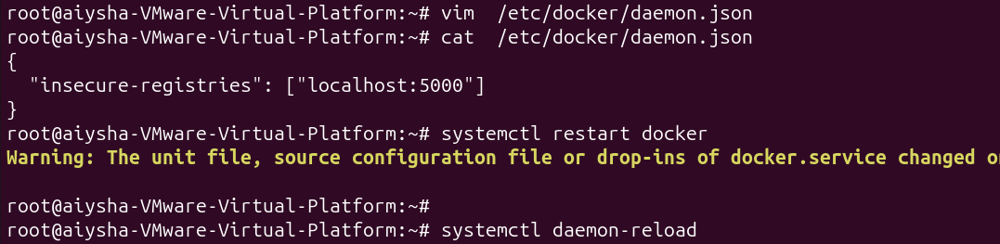
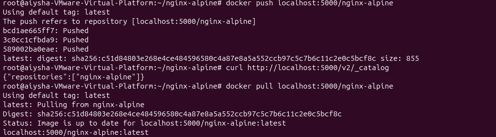
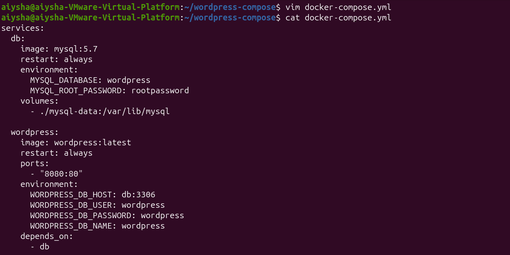
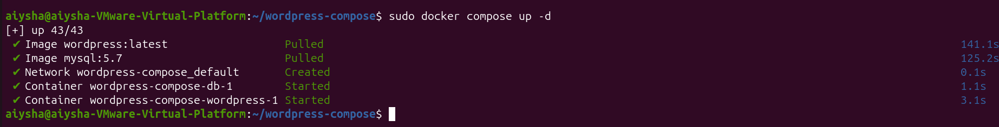
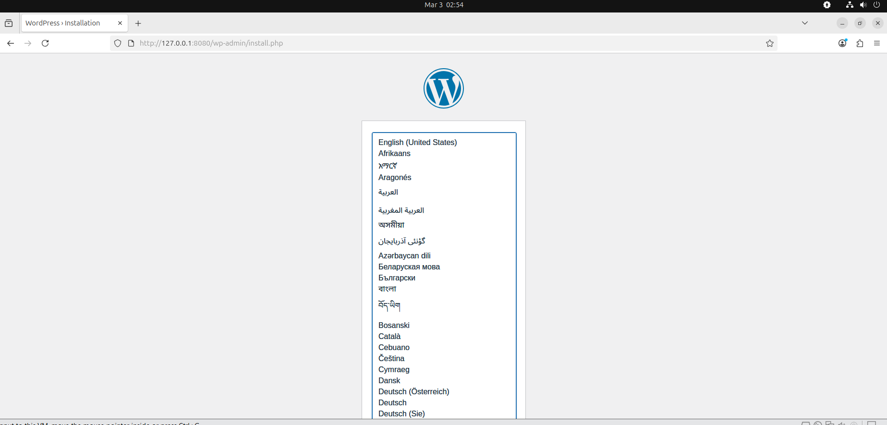
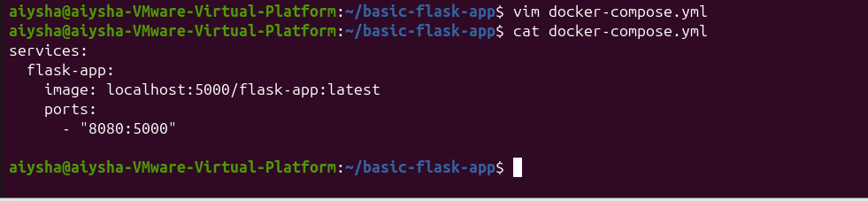
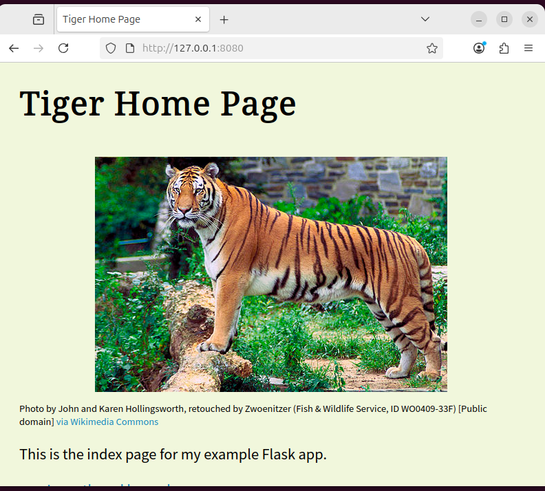
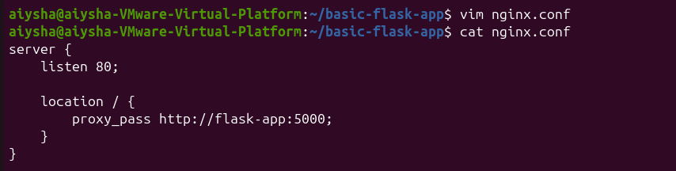
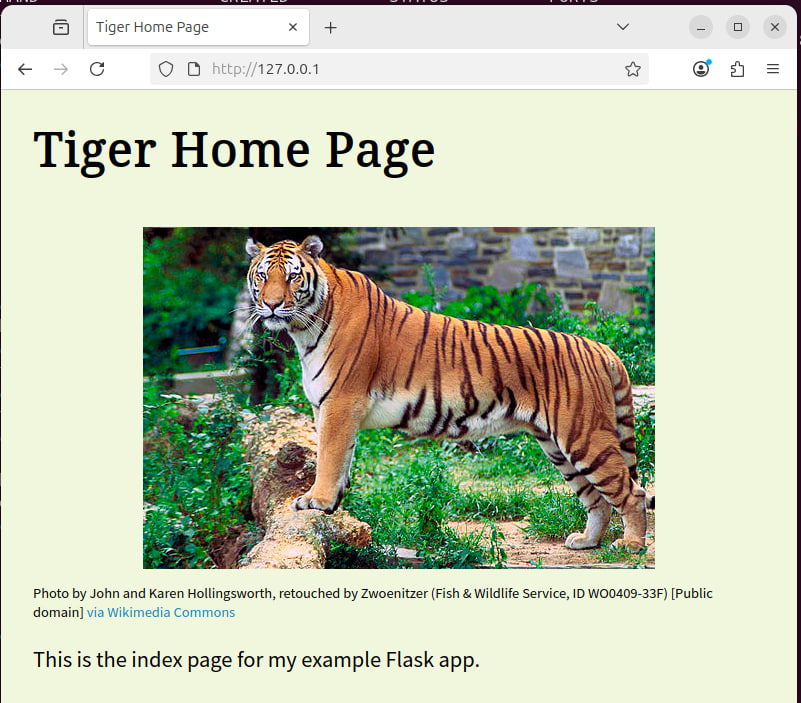

# Lab 3 – Docker Private Registry with Nginx Alpine
# Part 1

This lab demonstrates how to:
1. Run an **insecure Docker registry** locally.
2. Build a custom Docker image that installs and runs **Nginx** based on `alpine:latest`.
3. Push the image to the private registry.
4. Test pulling the image back from the registry.

---

## Step 1: Run an Insecure Registry
Start a local registry container:

```bash
docker run -d -p 5000:5000 --restart=always --name registry registry:2
```


## Step 2: Allow Insecure Registry
By default, Docker requires HTTPS. Configure Docker to allow HTTP:

1. Create `/etc/docker/daemon.json` if it doesn’t exist:
   ```bash
   vim /etc/docker/daemon.json
   ```

2. Add:
   ```json
   {
     "insecure-registries": ["localhost:5000"]
   }
   ```

3. Restart Docker:
   ```bash
   systemctl restart docker
   ```


## Step 3: Create a Dockerfile for Nginx
Make a new directory and Dockerfile:

```bash
mkdir nginx-alpine && cd nginx-alpine
vim Dockerfile
```

Contents:

```dockerfile
FROM alpine:latest
RUN apk update && install nginx
CMD ["nginx", "-g", "daemon off;"]
```

**Explanation:**
- `CMD ["nginx", "-g", "daemon off;"]`: Run Nginx in foreground so Docker can manage it.

---

## Step 4: Build the Image
```bash
docker build -t localhost:5000/nginx-alpine .
```

- `-t localhost:5000/nginx-alpine`: Tags image with registry address and name.
- `.`: Build context is current directory.

---


## Step 5: Push the Image
```bash
docker push localhost:5000/nginx-alpine
```

This uploads the image to your local registry.

---

## Step 6: Test the Registry
1. List repositories:
   ```bash
   curl http://localhost:5000/v2/_catalog
   ```

2. Pull the image back:
   ```bash
   docker pull localhost:5000/nginx-alpine
   ```

---

# Part 2: WordPress + MySQL with Docker Compose

This lab demonstrates how to:
1. Run WordPress (`wordpress:latest`) with a MySQL (`mysql:5.7`) database using Docker Compose.
2. Persist MySQL data on the host machine.
3. Expose WordPress on port **8080**.

---

## Step 1: Create a Project Directory
```bash
mkdir wordpress-compose
cd wordpress-compose
```

---

## Step 2: Write the `docker-compose.yml`
- **VIP:**
    - mysql 5.7 version was incompatible with wordpress:latest
    - wordpress couldn't access the database
    - when using mysql higher version as shown, wordpress accessed successfully




- **services:** → Top-level key that lists all containers.
  - **db (MySQL service):**
    - `image: mysql:5.7` → Pulls the official MySQL 5.7 image.
    - `environment:` → Sets required variables (e.g., `MYSQL_ROOT_PASSWORD`) so MySQL can start securely.
    - `volumes:` → Maps a host folder (`./mysql-data`) to `/var/lib/mysql` inside the container, ensuring database data persists.
  - **wordpress (WordPress service):**
    - `image: wordpress:latest` → Pulls the latest WordPress image.
    - `ports:` → Maps host port 8080 to container port 80, so WordPress is accessible at `http://localhost:8080`.
    - `environment:` → Provides DB connection details (host, user, password) so WordPress can talk to MySQL.
    - `depends_on:` → Ensures the database container starts before WordPress.


## Step 3: Start the Application
```bash
docker compose up -d
```

- `up`: Starts the services.
- `-d`: Detached mode (background).


Check running containers:
```bash
docker ps
```

---

## Step 4: Test the Setup
1. Open a browser on your host machine.
2. Navigate to:
   ```
   http://localhost:8080
   ```


---


# Part 3 – Deploy Flask App with Private Registry and Nginx

This lab demonstrates how to:
1. **Pushing the custom Flask image** (`iti-flask-lab2`) to a private Docker registry.
2. **Running the image with Docker Compose**, pulling it from the registry.
3. **Exposing the Flask app on port 8080** for direct access.
4. **Placing Nginx in front** of the Flask app as a reverse proxy, serving it on port 80.

---

## Step 1: Push Flask Image to Private Registry
The already built  Flask image in **Lab 2** was `iti-flask-lab2`.


- `docker tag` → re-labels the image with the registry address.  
- `docker push` → uploads the image to the registry.  
- `curl` → confirms the registry catalog contains `flask-app`.
---

## Step 2: Run Flask App with Compose (Before Nginx)
Create `docker-compose.yml`:



- `ports: 8080:5000` → maps host port 8080 to container port 5000.  
- This allows you to access the Flask app directly at `http://localhost:8080`.  

Run it:
```bash
docker compose up -d
```


Test:



---

## Step 3: Add Nginx in Front
Now extend `docker-compose.yml` to include Nginx:


---

## 🛠 Step 4: Configure Nginx
Create `nginx.conf` in the same directory:

```nginx
server {
    listen 80;

    location / {
        proxy_pass http://flask-app:5000;
    }
}
```


- `proxy_pass` → forwards requests to the Flask container on port 5000.  
- `flask-app` → service name resolved automatically by Docker Compose networking.  

---

## Step 5: Run and Test
Start the stack:

```bash
docker compose up -d
```

Test endpoints:


--
